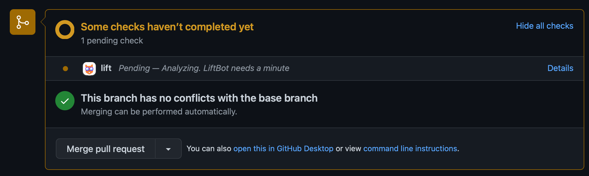

<!--

    Copyright (c) 2021-present Sonatype, Inc.

    Licensed under the Apache License, Version 2.0 (the "License");
    you may not use this file except in compliance with the License.
    You may obtain a copy of the License at

        http://www.apache.org/licenses/LICENSE-2.0

    Unless required by applicable law or agreed to in writing, software
    distributed under the License is distributed on an "AS IS" BASIS,
    WITHOUT WARRANTIES OR CONDITIONS OF ANY KIND, either express or implied.
    See the License for the specific language governing permissions and
    limitations under the License.

-->

# How To Run A Campaign

Here are some minimal steps to set up a new Bug Bash Campaign.

1. Create a new Campaign record:

       curl -u "theAdminUsername:theAdminPassword" -X PUT http://localhost:7777/admin/campaign/add/myCampaignName -d '{ "startOn": "2021-03-10T12:00:00.000Z", "endOn": "2022-03-15T12:00:00.000Z"}'

   Be sure you use a `startOn` and `endOn` date that is before today, and after today, otherwise the campaign will not
   be "active". Use the command below to verify your new campaign appears in the list of "active" campaigns:

       curl http://localhost:7777/campaign/active

2. Add the organization that owns the repository that will be having a bug bash. (For personal repositories, 
   the "organization" will just be your GitHub username.)

       curl -u "theAdminUsername:theAdminPassword" -X PUT http://localhost:7777/admin/organization/add -d '{ "scpName": "GitHub", "organization": "my-organization"}'

4. Add at least one participant (e.g. a GitHub user) who will be submitting bug fixes (PRs) during this campaign:

       curl -u "theAdminUsername:theAdminPassword" -X PUT http://localhost:7777/admin/participant/add -d '{ "scpName": "GitHub", "campaignName": "myCampaignName", "loginName": "mygithubid"}'

   Before going much further, you should ensure [Sonatype Lift](https://help.sonatype.com/lift/getting-started) is
   configured for your GitHub repository.

   To verify things are working, have the GitHub user (`mygithubid` in this example) generate
   a [Pull Request](https://docs.github.com/en/pull-requests/collaborating-with-pull-requests/proposing-changes-to-your-work-with-pull-requests/creating-a-pull-request)
   against a repository owned by the organization we added (`my-organization` in this example). Once the PR is created,
   you should see Lift performing an analysis of the PR, similar to this:
   

5. To view the current scores for your Bug Bash, open a browser to: http://localhost:7777/index.html

